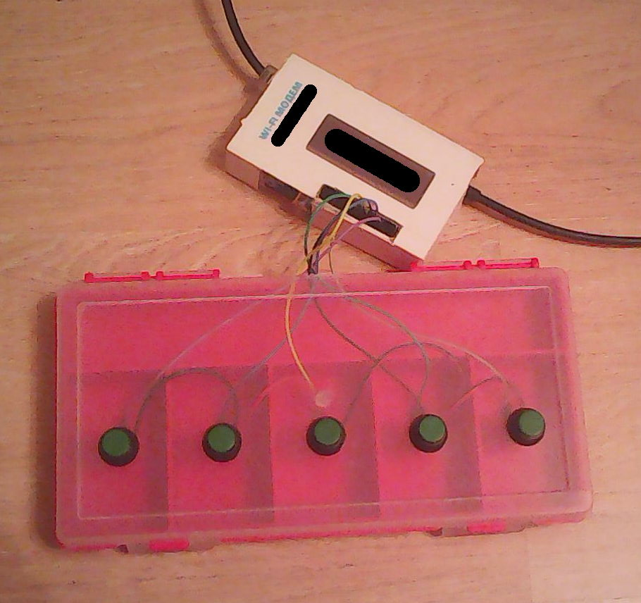

# pi-pedalboard

Pedalboard implementation for Raspberry Pi microcomputer.



## Requirements

* Raspberry Pi microcomputer with GPIO (with Raspbian OS installed on it)
* Python3
* [`gpiozero`](https://pypi.python.org/pypi/gpiozero) and
  [`radio-class`](https://pypi.python.org/pypi/radio-class) python packages
* Some buttons connected to GPIO
  ([see here for mapping](https://github.com/unclechu/pi-pedalboard/blob/6bfb629fed36bb0f536d0ea523d6a08b7d8fb66e/server.py#L20-L26)
  and [see here for pins numbers](https://www.raspberrypi.org/documentation/usage/gpio/))

## Usage

For example you have connected to your Raspberry PI over SSH and it has
`192.168.1.10` IPv4 address (use `nmap 192.168.1.0/24` to find its address
if you don't know it already).

1. Go to directory that is cloned version of this repo,
   create and init
   [virtual environment](https://pypi.python.org/pypi/virtualenv):

   ```bash
   python3 -m venv -- .venv
   source .venv/bin/activate

   ```

2. Install dependencies:

   ```bash
   pip install -r requirements.txt
   ```

3. Run pedalboard server:

   ```bash
   ./server.py
   ```

4. Go to your host machine terminal
   (it supposed to be linux-based distro with X11,
   `xdotool` and python3 installed) and run
   (in directory that is cloned version of this repo):

   ```bash
   ./client_numpad.py 192.168.1.10
   ```

   It will start a daemon that simulates numpad keys pressing by pushing on
   buttons on pedalboard. You could use this as basic example for everything
   you could imagine. I'm actually use it for switching between
   [guitarix](http://guitarix.org/) presets.

## Author

[Viacheslav Lotsmanov](https://github.com/unclechu)

## License

[GNU/GPLv3](./LICENSE)
